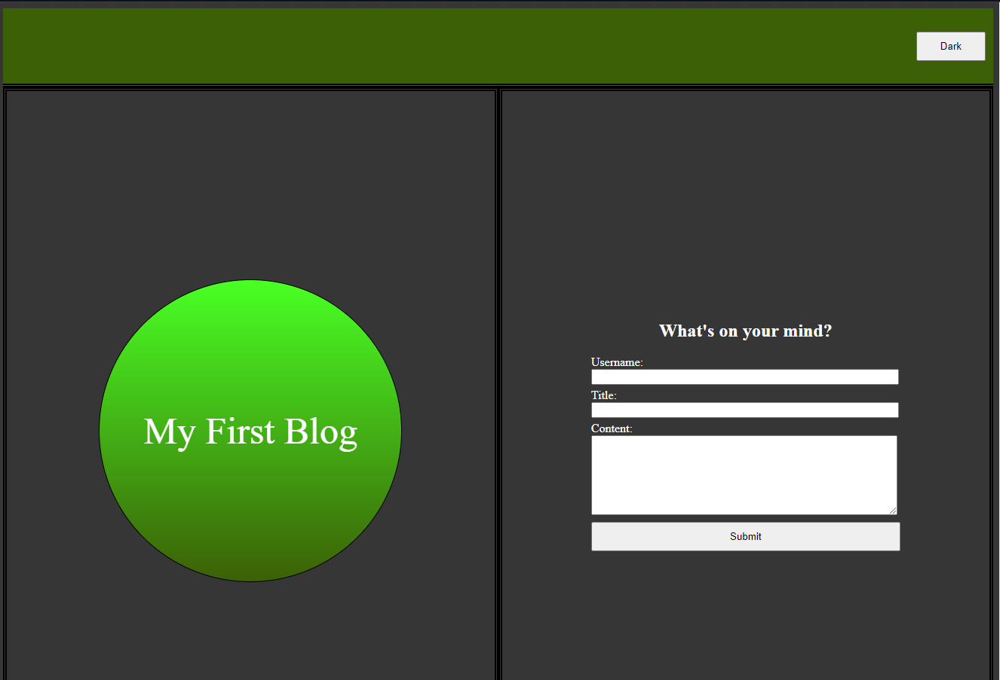
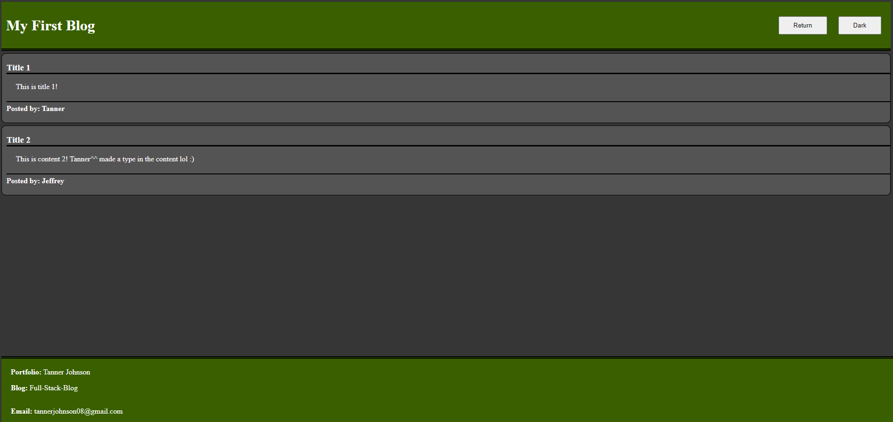
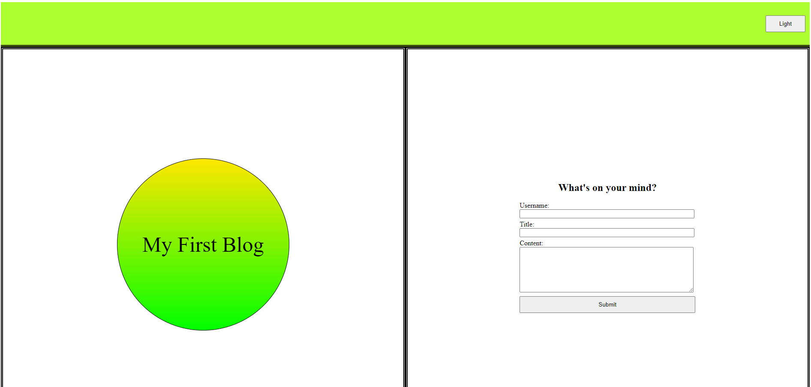
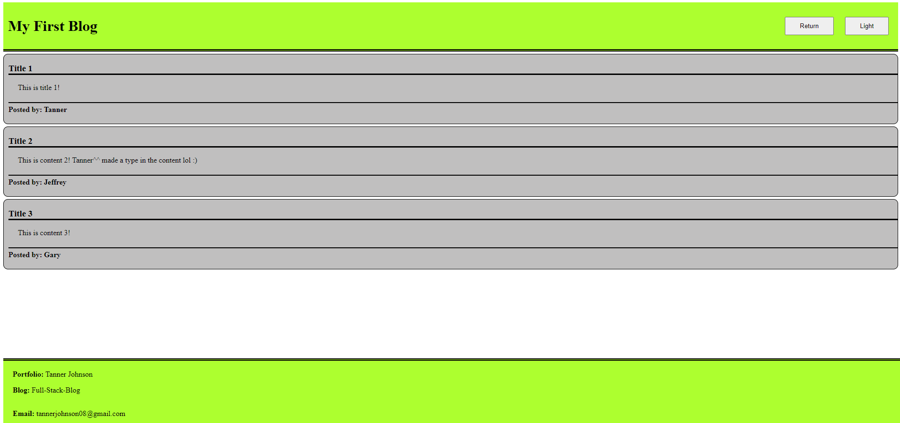

# 04 Web APIs: Personal Blog

In this assignment, I created a blog submission page and a blog post page. On the submission page, there is a form field to take in a user's username, title, and blog content. Once the user hits submit, they are brought to a second page that displays all of the blog posts in local storage with the latest appended to the bottom of the list. On the blog post page, all of the posts are displayed on the page, and there is a return button to the submission page. On both pages, there is a light/dark theme button which is also saved into local storage.

## Link to Deployed Version

https://tjjohnson76.github.io/hw04-web-APIs/

## Screenshot of Deployed Version

_______________________________________________________________________________________

_______________________________________________________________________________________

_______________________________________________________________________________________

